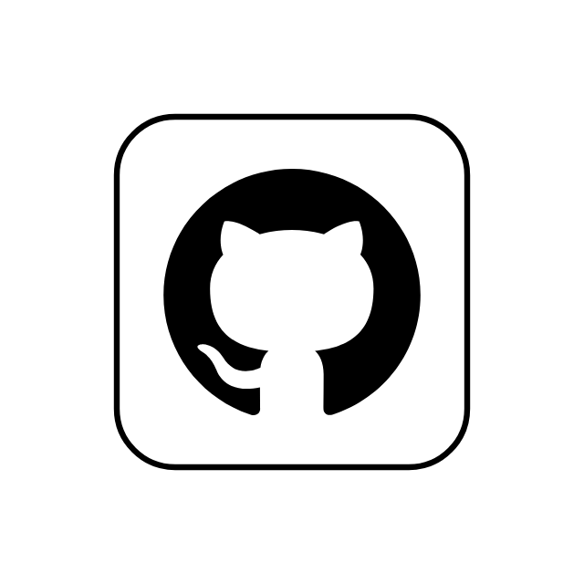

 
  
  <h1> Comandos git - PFS_UC7 </h1>

## 🧑🏻‍💻🧑🏻‍💻Desenvolvido por Marcos Roberto

@[MarcosRobertoOliver](https://github.com/MarcosRobertoOliver)
 

---

## 💡 Sobre a Atividade proposta 

Resolução de situação-problema apresentada, buscando uma soluções na preservação de históricos de alterações do código-fontes do Readme.md, na realização e conciliação de alterações em um mesmo repositório.

Consultei o material digital disponibilizado na plataforma do curso, seguindo as diretrizes propostas, bem como seguindo as ferramenta de versionamento de códigos abaixo:

• Acesse o site https://git-scm.com/downd/win .
• Instale a ferramenta GIT.
• Crie seu usuário e forneça um endereço de e-mail.
• Crie um repositório GIT local.
• Crie um arquivo para ser alterado e rastreado.
• Faça seu cadastro no GitHub: https://github.com 
• Crie um repositório on-line.
• Publique seu trabalho e faça alterações.
• Crie um arquivo README.md no repositório remoto para simular uma alteração feita por outro programador, elencando os principais comandos utilizados para gerenciar o versionamento de seu código e publique no repositório remoto.

## 🛠 Tecnologias Usadas

- Git
- GitHub
- VsCode
- LottieFiles
- Homebrew
